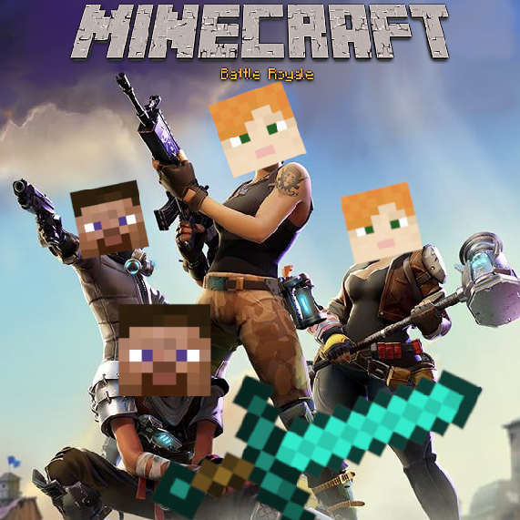

## What is it?
It is a Minecraft™️ [Ultra Hard Core](https://minecraft.gamepedia.com/Ultra_Hardcore) server.

## Game overview
- The entry fee is $5.
- The game is played in 1-week rounds.
- You'll spawn randomly in the map
- Every time you kill someone you get points.
- The player with the most points wins the round and one ranking point.
- The player with the most ranking points wins the game.

### Winning splits
The winners share all entry fees like this:
- 1st place: 50%
- 2nd place: 20%
- 3rd place: 10%
- (some charity): 20%

### Airdrops
If at least 2 people are online, there is a chance for an airdrop to occur!  
Random coordinates will be decided for the airdrop.  
You will be warned 30 minutes in advance.  
Once the airdrop occurs, a chest with (very good) loot will appear at those coordinates!

## Countdown

Made via https://www.sendtric.com/

## Some fine print
Due to the fact that we use Patreon as our money processor, 7.9% of each purchase and $.30 goes to Patreon as the cost for the page and currency processing. This is basically unaviodable. The actual amount that we recieve goes towards the winners and the charity. In other words, if 25 people sign up for $5 each, the first place winner will recieve less than $50.
